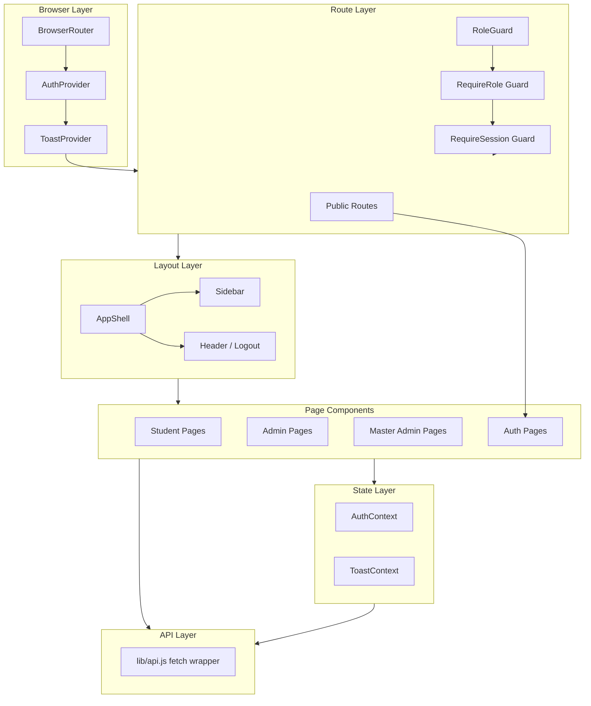
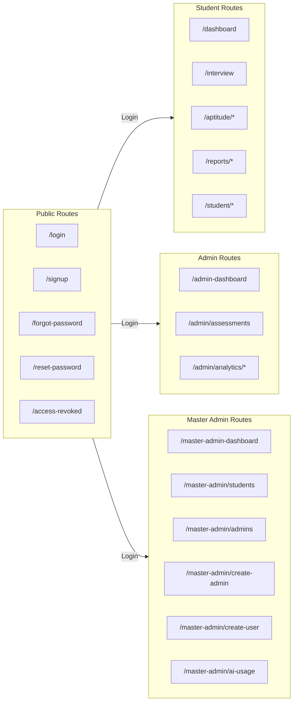
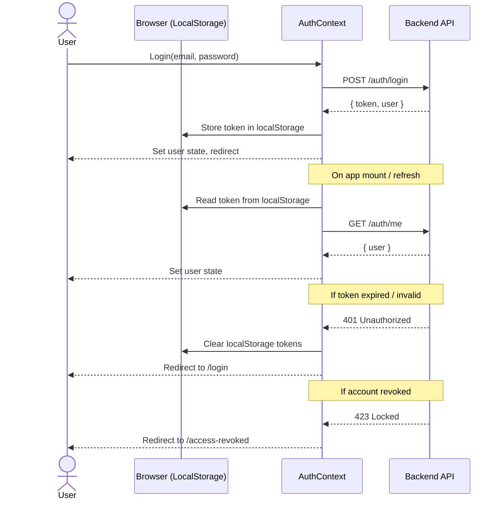
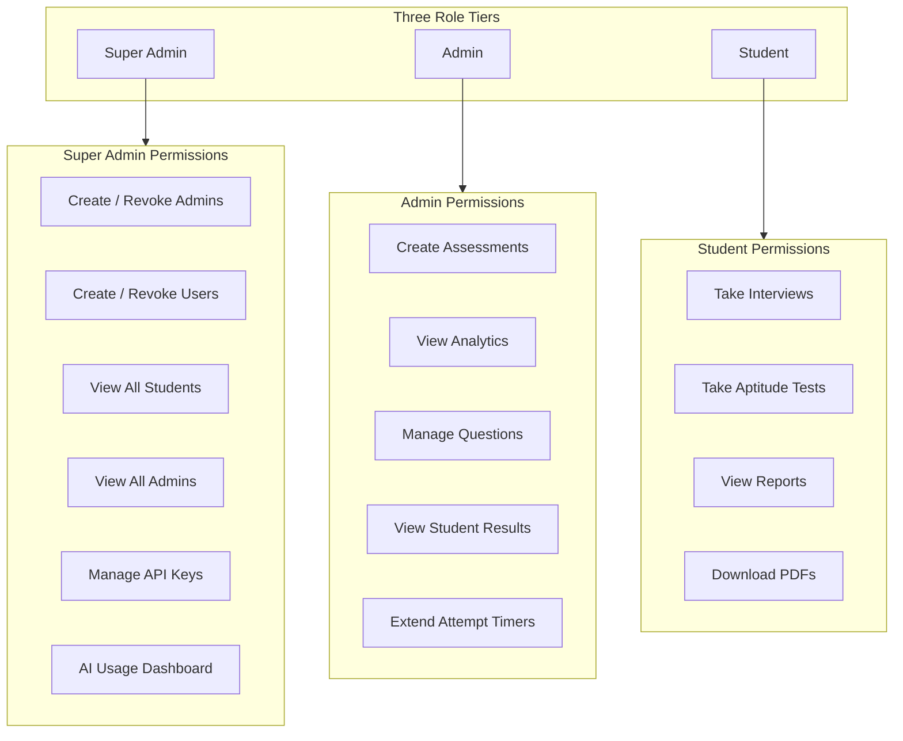
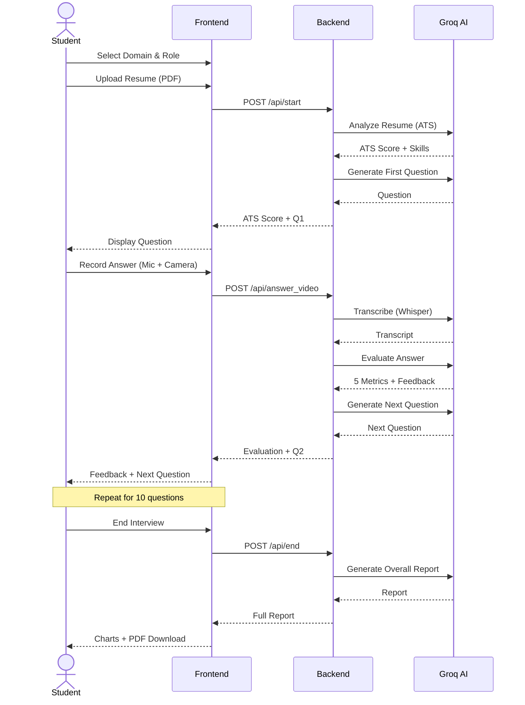
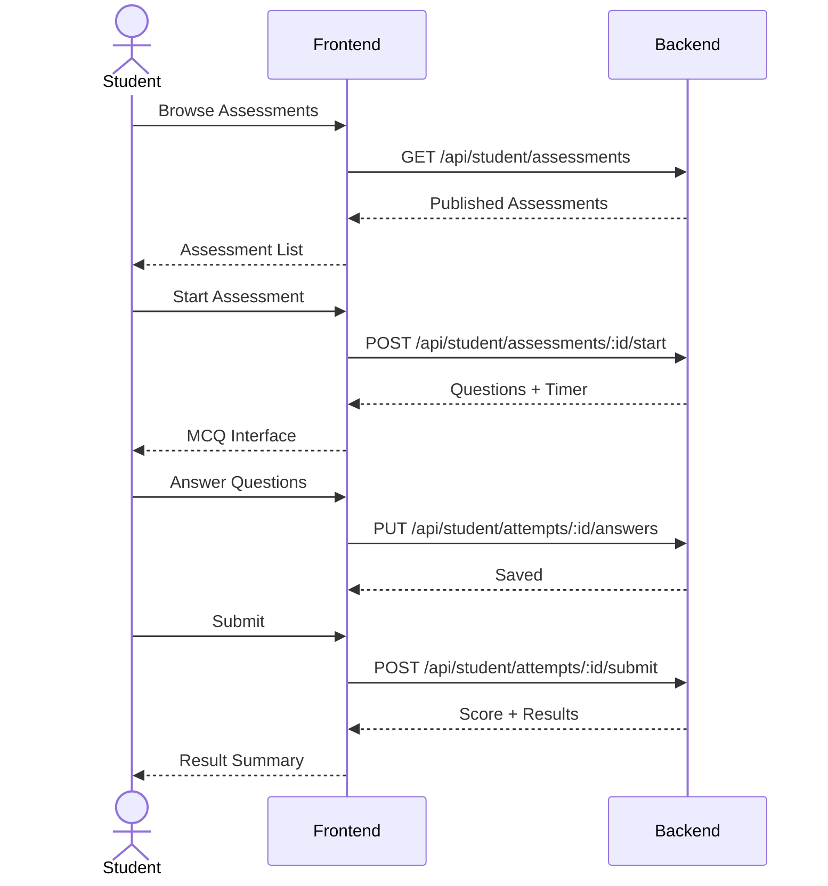
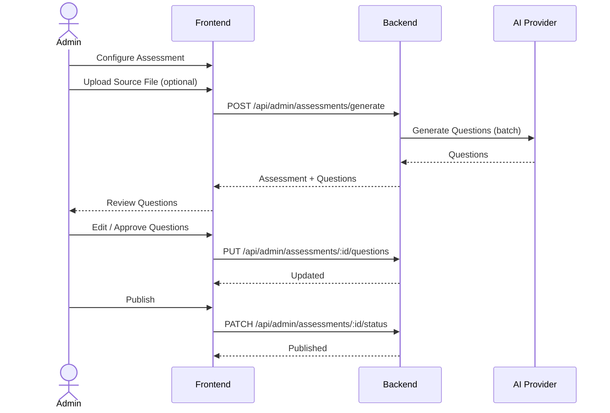

<p align="center">
  
  
  
  
  
  
</p>

<h1 align="center">PrepUp Frontend</h1>
<p align="center">
  <strong>React + Vite frontend for the PrepUp AI-driven placement readiness platform</strong>
  <br/>
  Mock interviews · Aptitude tests · Dashboards · Analytics · Reports
</p>

---

## Architecture Overview



---

## Route Hierarchy



---

## Authentication Flow



---

## Role-Based Access Control



---

## Tech Stack

| Category | Technology |
|---|---|
| **Framework** | React 18 |
| **Build Tool** | Vite 5 |
| **Styling** | Tailwind CSS 3 |
| **Routing** | React Router 7 |
| **Charts** | Recharts 2 |
| **Icons** | Lucide React |
| **State Management** | React Context (Auth + Toast) |
| **HTTP Client** | Native fetch |

---

## Getting Started

### Prerequisites

- Node.js 18 or later
- Backend server running

### Installation

```bash
git clone <repo-url>
cd frontend
npm install
cp .env.local.example .env.local
npm run dev
```

The app starts at **http://localhost:5173**.

### Production Build

```bash
npm run build
npm run preview
```

---

## Environment Variables

| Variable | Required | Default | Description |
|---|---|---|---|
| `VITE_API_URL` | Yes | `http://localhost:8000` | Backend API base URL |
| `VITE_API_KEY` | No | — | Optional API secret key |

The Vite dev server proxies `/api` requests to the configured backend URL.

---

## Pages by Role

### Authentication

| Route | Purpose |
|---|---|
| `/` | Role-based redirect or login |
| `/login` | Email + password sign in |
| `/signup` | Registration with auto role assignment |
| `/forgot-password` | Request reset email |
| `/reset-password` | Reset with token |
| `/access-revoked` | Account on hold notice |

### Student

| Route | Purpose |
|---|---|
| `/dashboard` | Overview with stats and topic performance |
| `/interview` | Full AI mock interview flow |
| `/aptitude` | Browse and take assessments |
| `/aptitude/:id/start` | Timed MCQ test interface |
| `/aptitude/results` | Assessment results list |
| `/aptitude/results/:id` | Per-question result detail |
| `/report` | Interview report viewer with charts |
| `/reports` | Combined reports and results |

### Admin

| Route | Purpose |
|---|---|
| `/admin-dashboard` | Overview with stats and quick actions |
| `/admin/assessments` | List and manage assessments |
| `/admin/assessments/create` | AI-powered question generation |
| `/admin/assessments/:id/questions` | Review and edit questions |
| `/admin/assessments/:id/results` | Student attempt monitoring |
| `/admin/analytics/aptitude` | Per-student aptitude analytics |
| `/admin/analytics/interviews` | Interview report analytics |

### Master Admin

| Route | Purpose |
|---|---|
| `/master-admin-dashboard` | Platform overview and usage stats |
| `/master-admin/students` | View all students with admin filter |
| `/master-admin/admins` | View all admin accounts |
| `/master-admin/master-admins` | View super admin accounts |
| `/master-admin/create-admin` | Create admins with module access |
| `/master-admin/create-user` | Create users with admin assignment |
| `/master-admin/ai-usage` | AI usage stats + API key management |

---

## Feature Deep Dive

### Mock AI Interview



### Aptitude Assessments



### Admin Assessment Creation



### User & Access Management

```mermaid
flowchart LR
    subgraph Creation["User Creation"]
        direction LR
        CA[Create Admin Form] --> BA[POST /api/master/admins]
        CU[Create User Form] --> BU[POST /api/master/users/create-with-details]
        CI[CSV/Excel Import] --> BI[POST /api/master/admins/import]
    end

    subgraph DB[(MongoDB Users)]
        direction LR
        MA[Master Admin]
        AD[Admin]
        ST[Student]
    end

    subgraph Actions["Management Actions"]
        direction LR
        RV[Revoke Access]
        RS[Restore Access]
        DL[Delete User]
        RO[Change Role]
    end

    Creation --> DB
    DB --> Actions
    Actions --> DB
```

---

## Components

### Shared Components

| Component | Purpose |
|---|---|
| `Sidebar` | Role-filtered navigation sidebar |
| `VoiceRecorder` | Mic/video recording with waveform |

### Portal Components

| Component | Purpose |
|---|---|
| `Sidebar` | Portal-styled student/admin sidebar |
| `RoleGuard` | Role-based route protection |
| `Timer` | Countdown with expiry callback |
| `StatCard` | Color-coded statistics card |
| `AssessmentCard` | Assessment display card |
| `QuestionList` | Editable question list |
| `QuestionEditorCard` | Individual question editor |
| `ResultSummary` | Score and pass/fail summary |
| `ManualGenerationForm` | AI assessment generation form |
| `LoadingSkeleton` | Animated loading placeholder |

---

## Project Structure

```
frontend/
├── index.html
├── vite.config.js
├── tailwind.config.js
├── components/
│   ├── Sidebar.jsx
│   └── VoiceRecorder.jsx
├── lib/
│   └── api.js
└── src/
    ├── main.jsx
    ├── App.jsx
    ├── constants.js
    ├── globals.css
    ├── navigation.jsx
    ├── portal/
    │   ├── context/
    │   │   ├── AuthContext.jsx
    │   │   └── ToastContext.jsx
    │   ├── utils/
    │   │   └── api.js
    │   ├── components/
    │   │   ├── Sidebar.jsx
    │   │   ├── RoleGuard.jsx
    │   │   ├── Timer.jsx
    │   │   ├── AssessmentCard.jsx
    │   │   ├── StatCard.jsx
    │   │   ├── QuestionList.jsx
    │   │   ├── QuestionEditorCard.jsx
    │   │   ├── ManualGenerationForm.jsx
    │   │   ├── ResultSummary.jsx
    │   │   └── LoadingSkeleton.jsx
    │   └── pages/
    │       ├── Login.jsx
    │       ├── Signup.jsx
    │       ├── ForgotPassword.jsx
    │       ├── ResetPassword.jsx
    │       ├── student/
    │       └── admin/
    └── pages/
        ├── DashboardPage.jsx
        ├── InterviewPage.jsx
        ├── AptitudePage.jsx
        ├── ReportPage.jsx
        ├── ReportsResultsPage.jsx
        ├── AccessRevoked.jsx
        ├── aptitude/
        └── admin/
```

---

## Scripts

| Command | Description |
|---|---|
| `npm run dev` | Start development server with hot reload |
| `npm run build` | Production build to `dist/` |
| `npm run preview` | Preview production build locally |

---

## License

MIT
